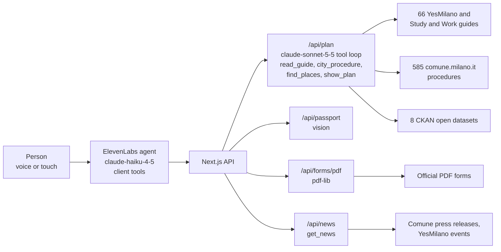

<p align="center">
  
</p>

<h1 align="center">Guida<b>MI</b></h1>

<p align="center"><i>Arrive in Milan. Say what you need. Get the steps, the office and the filled forms.</i></p>

<p align="center">
  <a href="https://guidami-milano.vercel.app"></a>
  <a href="https://guidami-milano.vercel.app/?demo=1"></a>
  
  <a href="LICENSE"></a>
  
  
  
</p>

<p align="center">
  
  
  
  
  
</p>
<p align="center"><sub>Welcome, need, plan, passport, forms. Sample data, fictional persona.</sub></p>

> Claude Impact Lab Milano · 3 October 2026 · Track 01 · Welcome journey for people arriving in Milan

**One line:** for a student who just landed in Milan and speaks no Italian, GuidaMI understands what she needs ("I need to rent a room"), reads the City's official guides and open data for her, tells her the steps in order with the right office nearby, and fills in the forms from a photo of her passport. She never opens a portal.

**Demo video:** _link added at submission_ (local files: `video/demo/`, `video/brag/`)

**Demo video:** _link added at submission_ (local files: `video/demo/`, `video/brag/`)

## The problem

Nour has just arrived in Milan to study. To know what to do she would have to read dozens of pages across YesMilano, comune.milano.it, ATM, Agenzia delle Entrate and the Questura, half of them in Italian, each holding one piece of the story and none saying "you, now, do this". She does things in the wrong order (no codice fiscale, so no contract, so no residenza, so no doctor), loses weeks, and feels like an outsider. Only 16% of mobility students feel really integrated (ESNsurvey) and about 4 in 10 international Polimi graduates leave Italy within a year.

## What we built

A mobile-first PWA, voice first at the start, then a normal touch app with optional audio.

1. **Welcome by voice.** The guide greets her in Italian, detects that she speaks English and switches. A big X closes the audio: everything also works by touch and text.
2. **Onboarding wizard (about 90 seconds).** One question per screen. While she talks, the cards light up and the profile fills in live (situation, EU or non-EU, interests, worries).
3. **Italian check.** She says "4", the guide runs three checks from a fixed bank, Claude judges them and the bar moves to "verified 2".
4. **"What do you need?"** She says "I need to rent a room". The guide asks "Shall I make your plan?" and waits for a yes.
5. **Claude reads for her.** The screen shows each official guide ticking as Claude reads it.
6. **The plan.** 3 to 5 steps in dependency order (codice fiscale, safe room search, registered contract, residenza within 20 days, TARI). Each step says what to bring, where, how long, the deadline, the nearest office from the City's open data and the source page.
7. **"Do it with me".** Tap a step: plain explanation, Listen, ask the guide, open the official app, mark as done.
8. **Fill it for me.** Take a photo of the passport (a SPECIMEN is included): the fields appear on screen to confirm or correct, the forms fill in, and she downloads the filled PDFs of the AA4/8 tax code form, the residence declaration and the TARI declaration. She checks and signs.
9. **City news.** She asks "what is on in Milan?" and the voice guide reads today's City news (Comune press releases, YesMilano events), always with the source.
10. **Previews** of what comes next: profile in the Fascicolo del Cittadino with SPID, "Parlami in italiano" coffees with Milanese volunteers, a Talent card so Milan companies find graduates before they leave.

Design: the approved mockup in [`design/mockups/index.html`](design/mockups/index.html) is the UI contract (Airbnb wizard language, YesMilano Study & Work colours).

## Architecture



## Where Claude works

Claude runs every time someone uses GuidaMI. Three places:

- **Models**
  - `claude-haiku-4-5` inside the ElevenLabs voice agent: the live conversation.
  - `claude-sonnet-5-5` for the plan (tool loop) and for reading the passport photo (vision).
- **What it does at runtime**
  - Holds the onboarding conversation in the person's language (Italian first, automatic language detection, English, Chinese, Spanish, Arabic).
  - Fills the profile through client tools while she talks: `update_profile`, `set_italian_level`, `set_goal`, `show_screen`, `request_passport`, `open_service`, `get_news`.
  - Judges the three Italian checks and sets the verified level.
  - Answers "what is happening in Milan?" with `get_news` (`GET /api/news`): up to 3 current items from Comune di Milano press releases and YesMilano events, always read out with date and source.
  - Builds the plan for her goal (`POST /api/plan`):
    - reads the relevant guides with `read_guide` (66 YesMilano and Study & Work pages, live, with a dated snapshot as fallback);
    - looks up official procedures with `city_procedure` (585 comune.milano.it service pages plus curated facts);
    - finds the right office near her with `find_places` (8 open datasets);
    - returns the result through the forced tool `show_plan`, validated with zod: every step must cite a guide it actually read, and a place must come from the City data.
  - Reads the passport photo (`POST /api/passport`) with the forced tool `passport_fields`. The image is never stored.
- **Prompts and tools**
  - Voice agent prompt: [`web/lib/agent-prompt.md`](web/lib/agent-prompt.md); agent and client tools: [`web/scripts/create-agent.mjs`](web/scripts/create-agent.mjs).
  - Planner prompt and tool loop: [`web/app/api/plan/route.ts`](web/app/api/plan/route.ts), [`web/lib/claude.ts`](web/lib/claude.ts); guides: [`web/lib/guides.ts`](web/lib/guides.ts); open data tools: [`web/lib/opendata.ts`](web/lib/opendata.ts).
  - City news: [`web/app/api/news/route.ts`](web/app/api/news/route.ts), [`web/lib/news.ts`](web/lib/news.ts).
  - Passport vision: [`web/app/api/passport/route.ts`](web/app/api/passport/route.ts).
  - Form filling is deterministic code, not AI: [`web/lib/forms.ts`](web/lib/forms.ts), [`web/app/api/forms/pdf/route.ts`](web/app/api/forms/pdf/route.ts) with pdf-lib.
- **What it decides, and what a human confirms**
  - Claude decides the next question, the verified Italian level, which guides to read and the order of the steps.
  - The person confirms the plan before it is built, confirms or corrects every field read from the passport, marks steps as done, and checks and signs every form. Nothing is submitted on her behalf.
  - She can switch the voice off at any time.
- **What happens when it's wrong**
  - Every step shows its source link, so a wrong step can be checked against the official page.
  - Passport fields are editable before any form is filled.
  - If a guide cannot be read live the app says so and uses the dated copy.
  - If Claude does not return a valid plan, the app shows an honest error with Retry, never an invented plan.
  - The plan ends with "what to double-check with the City".

## City data and sources

All public, retrieved 3 October 2026. Full table: [`docs/DATA_SOURCES.md`](docs/DATA_SOURCES.md).

| Source | How we used it |
|---|---|
| `ds549` Sedi dei servizi anagrafici (13 offices) | nearest registry office for residenza and identity card |
| `ds1299` Sedi dei municipi (9) | which municipio she lives in and her reference office |
| `ds94` Sedi universitarie (90) | starting point: "near your university" |
| `ds550` Sindacati e patronati (90) | free help with the residence permit and forms |
| `ds551` Scuole di italiano per stranieri e CPIA (115) | where to learn Italian |
| `ds1303` Servizio sociale territoriale (19) | support services |
| `ds41` Biblioteche comunali (45, data from 2007, flagged) | study places, library card |
| `ds535` Fermate metro ATM (130) | nearest metro stop for each office |
| YesMilano "How to" and Study & Work guides (66 pages) | read live by Claude to build each plan, cited per step |
| comune.milano.it service catalogue (585 procedure pages) | rules, channels, documents, deadlines as written on the page |
| Official forms: AA4/8 (Agenzia delle Entrate), dichiarazione di residenza (Ministero dell'Interno), TARI nuova occupazione (Comune di Milano) | pre-filled PDFs |

## Day one

- **What the Comune needs to switch it on:** one link in the automatic welcome email and on the YesMilano student pages. The content stays theirs: we read their guides and data, we do not copy them.
- **Proactive reminders (the brief's "Watch out").** Today the app shows her own deadlines on the home screen (residence permit within 8 days of arrival, residenza within 20 days, TARI). Version 2 sends them as notifications, with her consent:

  | Reminder | When | Data needed |
  |---|---|---|
  | Residence permit kit | day 3 after arrival | arrival date (she gives it) |
  | Residenza | after the contract is registered | contract date (she gives it) |
  | Police check visit for residenza | when the request is filed | status of the request (ANPR via PDND) |
  | TARI declaration | within 90 days of occupation | start of occupation, residenza status |
  | Identity card booking | once residenza is confirmed | residenza status (ANPR via PDND) |

- **Data that would help (for the Chief Data Officer)**
  - SPID/CIE attributes at login and ANPR e-services C020/C021 through PDND, so the forms fill without a photo (once-only principle).
  - A single machine-readable feed of events (Welcome Days, Italian courses, career days) from the City, universities and companies.
  - Consent-based profiles companies can search.
- **Version 2**
  - Profile saved in the Fascicolo del Cittadino.
  - "Parlami in italiano": Milanese volunteers, modelled on Barcelona's Voluntariat per la Llengua.
  - Talent card for companies.

## The vision

GuidaMI starts with the person who arrives. The same data can serve two more sides.

| Side | Idea | Status |
|---|---|---|
| **Person** | Paperwork in the right order, filled forms, Italian check | Built |
| **Person** | Voice guide that knows today's City news | Built |
| **Person** | Community "Parlami in italiano": coffees with Milanese volunteers | Concept, preview screen only |
| **Company** | Talent card with the student's consent, so companies find graduates before they leave | Concept, preview screen only |
| **Company** | Study-to-work permit pre-filled | Concept |
| **City** | One link in the welcome email | Concept (needs the Comune) |
| **City** | Anonymous dashboard of unanswered questions and deadlines | Concept |

## Run it

```bash
git clone https://github.com/Thomas-Piva/milano-evolution
cd milano-evolution/web
cp ../.env.example .env.local   # add ANTHROPIC_API_KEY and ELEVENLABS_API_KEY
npm install
node scripts/create-agent.mjs  # creates the ElevenLabs agent, writes ELEVENLABS_AGENT_ID
npm run dev                    # http://localhost:3000
```

Without keys the app still runs: open `/?demo=1` for the full flow with sample data (clearly labelled), `/?demo=1&screen=plan` to jump to a screen. Tests: `npx vitest run`.

## Team

| Name | Role | GitHub |
|---|---|---|
| Thomas Piva | product, build | Thomas-Piva |

## Licence

MIT. Built at the Claude Impact Lab Milano and donated to the Comune di Milano. No personal data: the passport in the repo is a fictional SPECIMEN, and Nour is a fictional persona.
