<p align="center">
  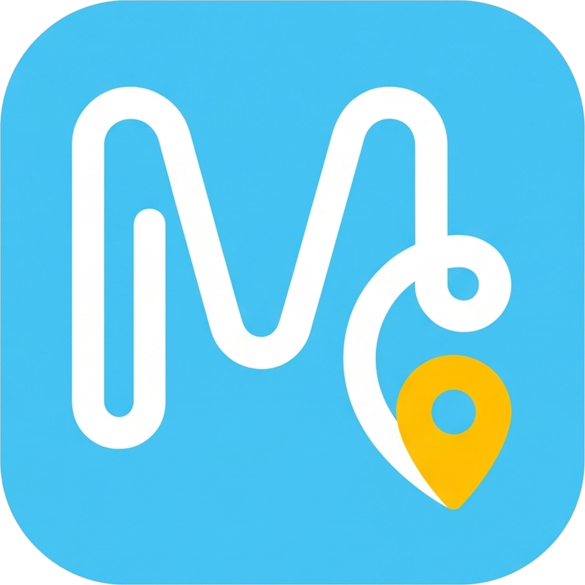
</p>

<h1 align="center">Guida<b>MI</b></h1>

<p align="center"><i>Guido, the City of Milan's assistant for people who just arrived. Say what you need, get the steps, the right office and the filled forms.</i></p>

<p align="center">
  <a href="https://guidami-milano.vercel.app/?demo=1"></a>
  <a href="pitch/guidami-demo.mp4"></a>
  <a href="pitch/GuidaMI-pitch.pdf"></a>
  
  <a href="LICENSE"></a>
</p>

<p align="center">
  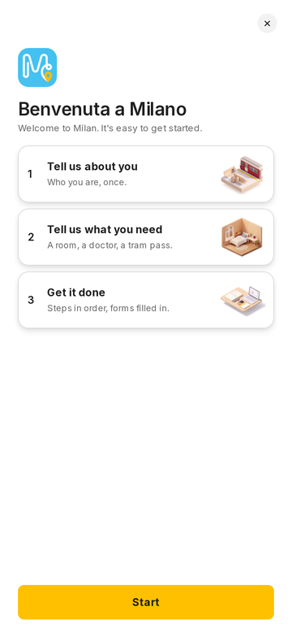
  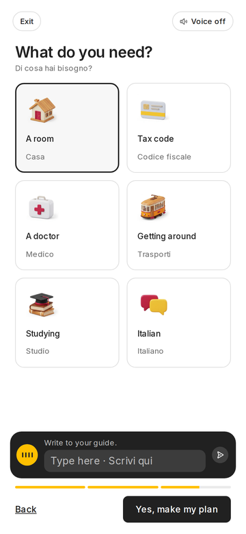
  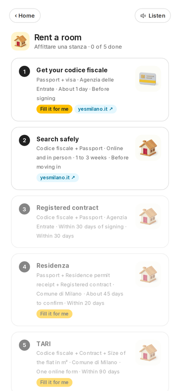
  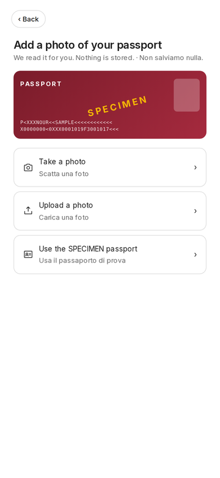
  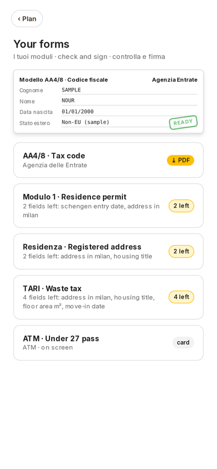
</p>
<p align="center"><sub>Welcome, need, plan, passport, forms. Sample data and a fictional persona.</sub></p>

> Claude Impact Lab Milano · 3 October 2026 · Track 01 · Welcome journey for people arriving in Milan

**One line:** a student lands in Milan and speaks no Italian. She tells Guido what she needs ("I need to rent a room"). Guido reads the City's official guides and open data for her, gives her the steps in the right order with the office closest to her, and fills in the forms from a photo of her passport. She never has to open a portal.

**Demo video:** [`pitch/guidami-demo.mp4`](pitch/guidami-demo.mp4) (107 s, silent, chapter titles on screen), also embedded in the deck · **Live app:** https://guidami-milano.vercel.app/?demo=1

## Presentation

Open the deck right here on GitHub: [`pitch/GuidaMI-pitch.pdf`](pitch/GuidaMI-pitch.pdf). The PowerPoint version, [`pitch/GuidaMI-pitch.pptx`](pitch/GuidaMI-pitch.pptx), has the 107-second demo video embedded on slide 3, so it plays even when the file is sent as an attachment. The video on its own: [`pitch/guidami-demo.mp4`](pitch/guidami-demo.mp4).

<p align="center">
  <a href="pitch/GuidaMI-pitch.pdf">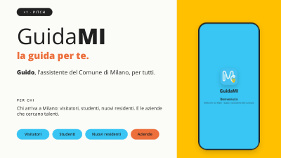</a>
  <a href="pitch/GuidaMI-pitch.pdf">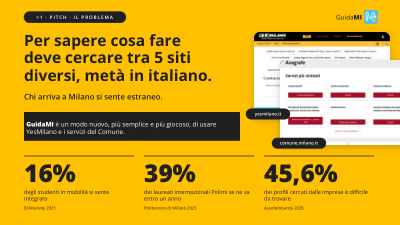</a>
  <a href="pitch/GuidaMI-pitch.pdf"></a>
  <a href="pitch/GuidaMI-pitch.pdf">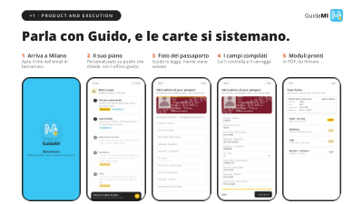</a>
  <a href="pitch/GuidaMI-pitch.pdf">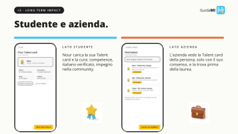</a>
  <a href="pitch/GuidaMI-pitch.pdf">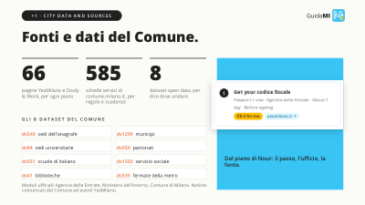</a>
  <a href="pitch/GuidaMI-pitch.pdf">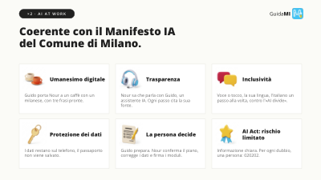</a>
  <a href="pitch/GuidaMI-pitch.pdf">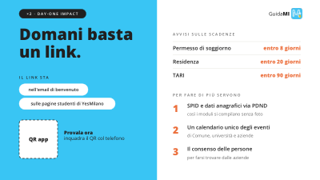</a>
</p>

## How GuidaMI answers the jury's five questions

| Criterion | Weight | Our answer |
|---|---|---|
| Day-one impact | ×2 | The City switches it on with one link in the automatic welcome email and on the YesMilano student pages. The guides and data stay the City's; GuidaMI reads them where they already live. |
| AI at work | ×2 | Every session runs on Claude: the conversation, the Italian check, the choice of guides, the order of the steps and the reading of the passport. The person confirms the plan, corrects every field and signs every form. |
| City data and sources | ×1 | 66 YesMilano and Study & Work guides, 585 comune.milano.it service pages and 8 open datasets from dati.comune.milano.it. Every step in a plan links to the page it came from. |
| Product and execution | ×1 | The flow works end to end, from the welcome to a downloaded PDF, by voice or by touch. 35 automated tests pass. |
| Pitch | ×1 | One person, Nour, followed from the day she arrives to the day a Milan company hires her. |

## The problem

Nour arrives in Milan to study. To find out what to do she would have to search five different sites (YesMilano, comune.milano.it, ATM, Agenzia delle Entrate, the Questura), half of them in Italian. Each site holds one piece of the process and none tells her what to do first. So she does things in the wrong order: without a codice fiscale she cannot sign a contract, without a contract she cannot register her residence, and without residence she cannot get a doctor. She loses weeks and feels like an outsider.

The numbers say the same. Only 16% of mobility students feel really integrated (ESNsurvey), about 4 in 10 international Politecnico graduates leave Italy within a year (Politecnico di Milano, 2025), and 45.6% of the profiles Milan companies look for are hard to find (Assolombarda, 2025).

## What we built

A mobile-first web app you can install on the phone. It starts with Guido's voice and then works as a normal touch app, with audio when she wants it.

1. **Arrives in Milan.** She opens GuidaMI from the link in the City's welcome email. Guido greets her in Italian and says up front that he is an AI assistant; for a person she can call 020202.
2. **Talks to Guido.** She answers in English and Guido switches to English. Her profile fills in while she talks: just arrived, non-EU, interests, worries. She can close the voice with the X and carry on by touch.
3. **Her Italian.** She says her level is 4. Guido asks three short questions, judges the answers and moves the bar to "verified 2". From then on the app teaches her one word at a time.
4. **Says what she needs.** "I need to rent a room." Guido asks "Shall I make your plan?" and waits for her yes.
5. **Guido reads for her.** The screen shows each official guide being read.
6. **Her plan.** Five steps in dependency order: codice fiscale, a safe room search, a registered contract, residence within 20 days, TARI. Each step says what to bring, where to go, how long it takes and the deadline. The office comes from the City's open data (the registry office of her municipio, the nearest patronato, the closest metro stop), and every step links to the official page.
7. **Do it with me.** She taps a step and gets a plain explanation, a Listen button, a way to ask Guido, the official app and "Done".
8. **Passport photo, forms ready.** She takes a photo of her passport (the repo includes a fictional SPECIMEN). The fields appear on screen for her to check and correct, then the AA4/8 tax code form, the residence declaration and the TARI declaration come out as filled PDFs. She checks them and signs.
9. **City news.** She asks what is on in Milan and Guido reads the day's Comune press releases and YesMilano events, each with its source.

The same app already shows the next stops of her journey, as working screens with sample data at `/concept?s=…`:

| Side | Screen | What it does |
|---|---|---|
| Person | A coffee with a Milanese (`parlami`) | Guido matches her with a Milanese volunteer at a City library and gives her three phrases to use. |
| Person | This week in Milan (`eventi`) | Welcome Day, Italian conversation, career day, and who from her course is going. |
| Person | Save it once (`fascicolo`) | With SPID her profile moves into the Fascicolo del Cittadino and the next forms fill themselves. |
| Student | Talent card (`talent-card`) | She builds her own card: skills, verified Italian, community work. She decides who sees it. |
| Company | Find talent (`talent-search`) | A company asks for "junior designer, Italian B1, from March" and sees the students who gave consent, contacted through YesMilano. |
| Student | Study to work (`permesso`) | At graduation the study-to-work permit conversion is pre-filled, with a welcome kit for her employer. |
| City | What newcomers need (`comune`) | Anonymous counts of unanswered questions and upcoming deadlines, so the City knows which pages to write. |

## Where Claude works

Claude runs every time someone uses GuidaMI, in three places.

**The conversation.** `claude-haiku-4-5` runs inside the ElevenLabs voice agent. It holds the onboarding in the person's language (Italian first, then automatic detection of English, Chinese, Spanish or Arabic), asks one question at a time, and fills the profile through client tools while she talks: `update_profile`, `set_italian_level`, `set_goal`, `build_plan`, `show_screen`, `request_passport`, `open_service`, `get_news`. It judges the three Italian answers and sets the verified level. Prompt: [`web/lib/agent-prompt.md`](web/lib/agent-prompt.md). Agent and tools: [`web/scripts/create-agent.mjs`](web/scripts/create-agent.mjs).

**The plan.** `claude-sonnet-5-5` runs a tool loop in `POST /api/plan` ([`web/app/api/plan/route.ts`](web/app/api/plan/route.ts), [`web/lib/claude.ts`](web/lib/claude.ts)). It decides which guides to read with `read_guide` ([`web/lib/guides.ts`](web/lib/guides.ts)), looks up procedures with `city_procedure` and offices with `find_places` ([`web/lib/opendata.ts`](web/lib/opendata.ts)), and returns the plan through `show_plan` with a strict schema. If it answers in plain text, the route retries once with structured output on the same schema. The server rejects any step whose source is not a guide read in that request, and any place that is not in the City data.

**The passport.** `claude-sonnet-5-5` reads the photo in `POST /api/passport` ([`web/app/api/passport/route.ts`](web/app/api/passport/route.ts)) and returns the fields through a structured output schema. The image is checked (JPEG or PNG, at most 5 MB), never stored and never logged. Filling the PDFs is plain code, not AI: [`web/lib/forms.ts`](web/lib/forms.ts) and [`web/app/api/forms/pdf/route.ts`](web/app/api/forms/pdf/route.ts) with pdf-lib.

**What Claude decides and what the person confirms.** Claude picks the next question, the verified Italian level, the guides to read and the order of the steps. The person says yes before the plan is built, checks or corrects every field read from the passport, marks steps as done and signs every form. Nothing is sent on her behalf, and she can switch the voice off at any time.

**When it is wrong.** Every step links to its source page, so a wrong step can be checked. Passport fields stay editable before any form is filled. If a guide cannot be read live, the app says so and uses the copy taken on 3 October 2026. If no valid plan comes back, the app shows an error with Retry and never invents one. Each plan ends with what to double-check with the City.

## Built on the City of Milan AI Manifesto

| Principle | In GuidaMI |
|---|---|
| Digital humanism | Guido's last step is a coffee with a Milanese: the assistant brings people together. |
| Transparency | She knows she is talking to an AI assistant and sees the source of every step. |
| Inclusion | Voice or touch, her own language, Italian one step at a time. |
| Data protection | Her data stays on her phone; the passport photo is never stored. |
| Human control | She confirms and signs; for any doubt there is a person at 020202. |
| AI Act | Digital assistance to citizens, limited risk: clear disclosure and a human operator. |

## City data and sources

All public, retrieved on 3 October 2026. Full table: [`docs/DATA_SOURCES.md`](docs/DATA_SOURCES.md).

| Source | Where it is used in the app |
|---|---|
| `ds549` Sedi dei servizi anagrafici (13 offices) | the registry office for residence and identity card, on the plan step |
| `ds1299` Sedi dei municipi (9) | her municipio and its reference office |
| `ds94` Sedi universitarie (90) | "near your university" searches |
| `ds550` Sindacati e patronati (90) | free help with the residence permit and the forms |
| `ds551` Scuole di italiano per stranieri e CPIA (115) | where to learn Italian |
| `ds1303` Servizio sociale territoriale (19) | support services |
| `ds41` Biblioteche comunali (45, data from 2007, flagged in the app) | study places and the coffee with a Milanese |
| `ds535` Fermate metro ATM (130) | the closest metro stop to each office |
| YesMilano and Study & Work guides (66 pages) | read by Claude for every plan and cited on each step |
| comune.milano.it service catalogue (585 pages) | rules, channels, documents and deadlines, as written on each page |
| Official forms: AA4/8 (Agenzia delle Entrate), dichiarazione di residenza (Ministero dell'Interno), TARI nuova occupazione (Comune di Milano) | the filled PDFs |
| Comune di Milano press releases, YesMilano events | Guido's answers about what is on in the city |

## Day one

The City switches GuidaMI on with one link in the automatic welcome email and on the YesMilano student pages.

The home screen already shows her own deadlines (residence permit within 8 days of arrival, residence within 20 days, TARI). With her consent, a second version sends them as reminders:

| Reminder | When | Data needed |
|---|---|---|
| Residence permit kit | day 3 after arrival | arrival date, which she gives |
| Residence | after the contract is registered | contract date, which she gives |
| Police check for residence | when the request is filed | request status (ANPR via PDND) |
| TARI declaration | within 90 days of moving in | move-in date, residence status |
| Identity card booking | once residence is confirmed | residence status (ANPR via PDND) |

Three things would let the City do more. SPID or CIE login with the ANPR e-services C020 and C021 through PDND would fill the forms without a photo, following the once-only principle. A single machine-readable feed of events from the City, universities and companies would power the weekly agenda. And consent-based student profiles would let companies find graduates before they leave.

## Run it

```bash
git clone https://github.com/Thomas-Piva/guidaMI
cd guidaMI/web
cp ../.env.example .env.local   # add ANTHROPIC_API_KEY and ELEVENLABS_API_KEY
npm install
node scripts/create-agent.mjs  # creates the ElevenLabs agent, writes ELEVENLABS_AGENT_ID
npm run dev                    # http://localhost:3000
```

API keys live only in `web/.env.local`, which git ignores; `.env.example` holds placeholders. Without keys the app still runs. Open `/?demo=1` for the whole flow with sample data (labelled as such), `/?demo=1&screen=plan` to jump to one screen, `/splash` for the opening screen and `/concept?s=talent-search` for the next stops. Tests: `npx vitest run`.

## Team

| Name | Role | GitHub |
|---|---|---|
| Thomas Piva | product, build | Thomas-Piva |

## Licence

MIT. Built at the Claude Impact Lab Milano and donated to the Comune di Milano. The repo holds no personal data: the passport is a fictional SPECIMEN and Nour is a fictional persona.
